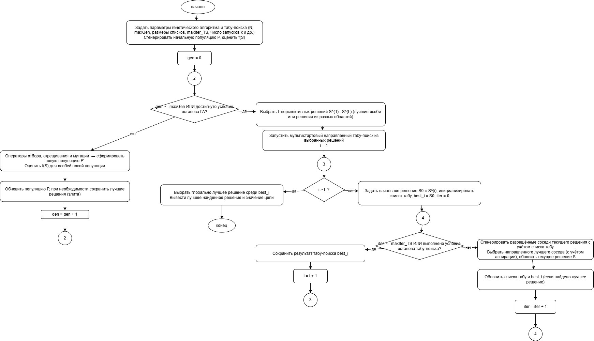
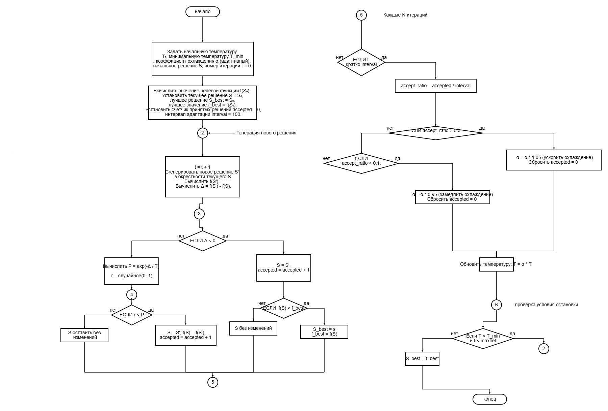
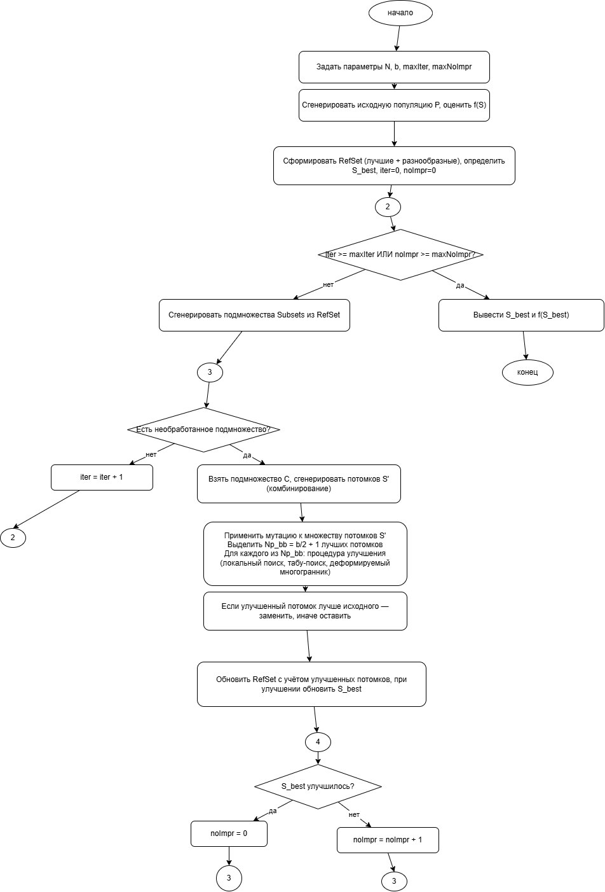

# 🐦 Kukushka и остальные

<div align="center">

### Интерактивная визуализация метаэвристик и популяционных методов оптимизации

<p>
  
  
  
</p>

<p>
  
  
  
</p>

</div>

> Проект показывает, как работают `GA + Tabu`, `Simulated Annealing` и `Scatter Search` на одной карте целевой функции — с анимацией, графиком сходимости, пошаговым режимом и журналом выполнения.

---

## ✨ Что здесь есть

- интерактивный выбор алгоритма и целевой функции
- визуальная карта поиска в 2D
- график сходимости по итерациям
- пошаговый режим выполнения алгоритма
- лог текущих фаз и изменений состояния
- наглядная демонстрация поведения разных метаэвристик

## 🚀 Запуск

Проект полностью статический: без бэкенда, без сборки, без установки зависимостей.

### Вариант 1 — открыть сразу

1. Склонируйте репозиторий или скачайте архив.
2. Откройте `index.html` в браузере.

### Вариант 2 — поднять локальный сервер

#### Через Python

```bash
python -m http.server 8000
```

Откройте:

```text
http://localhost:8000
```

#### Через Node.js

```bash
npx serve .
```

После запуска откройте адрес, который покажет терминал.

## 🕹️ Как пользоваться

1. Выберите алгоритм:
   - `GA + Tabu`
   - `Simulated Annealing`
   - `Scatter Search`
2. Выберите целевую функцию:
   - `Sphere`
   - `Rastrigin`
   - `Ackley`
3. Настройте параметры запуска.
4. Нажмите:
   - `Сброс` — подготовка алгоритма
   - `Старт` — запуск анимации
   - `Пауза` — остановка
   - `Шаг` — пошаговое выполнение

## 🧠 Алгоритмы внутри

<table>
  <tr>
    <td align="center" width="33%">
      <strong>GA + Tabu</strong><br />
      <a href="./genetik.jpg">
        
      </a>
    </td>
    <td align="center" width="33%">
      <strong>Simulated Annealing</strong><br />
      <a href="./otshig.jpg">
        
      </a>
    </td>
    <td align="center" width="33%">
      <strong>Scatter Search</strong><br />
      <a href="./rasseivanie.jpg">
        
      </a>
    </td>
  </tr>
</table>

## 📁 Структура проекта

```text
.
├── index.html        # интерфейс приложения
├── styles.css        # оформление и layout
├── app.js            # логика визуализации и алгоритмов
├── genetik.jpg       # схема Genetic + Tabu
├── otshig.jpg        # схема Simulated Annealing
├── rasseivanie.jpg   # схема Scatter Search
└── kukushka.jpg      # дополнительное изображение проекта
```

## 💡 Почему проект удобен для демонстрации

- подходит для учебных работ и презентаций
- помогает сравнивать поведение алгоритмов визуально
- показывает не только результат, но и процесс поиска
- запускается буквально в один файл

## 🖥️ Требования

- любой современный браузер с поддержкой JavaScript

## ✅ Проверка алгоритмов

В проект добавлены детерминированные headless-проверки, которые прогоняют именно код из `app.js`, но без браузера.

### Быстрые проверки

```bash
node scripts/run-algorithm-tests.js
```

Что проверяется:

- завершение всех алгоритмов
- монотонность `best-so-far`
- сохранение точек внутри границ поиска `[-5, 5]`
- инварианты `GA + Tabu`, `Simulated Annealing`, `Scatter Search`
- sanity-check сходимости на `Sphere`

### Подробный отчёт

```bash
node scripts/verify-algorithms.js
```

Экспорт в файлы:

```bash
node scripts/verify-algorithms.js --json reports/algorithm-verification.json --csv reports/algorithm-verification.csv
```

Отчёт показывает:

- результат по нескольким `seed`
- стартовое и финальное значение функции
- процент улучшения
- число шагов
- сравнение для `Sphere`, `Ackley`, `Rastrigin`

Короткая готовая записка для преподавателя: `ALGORITHM_VERIFICATION_SUMMARY.md`

## 🔗 Репозиторий

GitHub: `https://github.com/NimmWee/kukushka-i-ostalnie.git`
